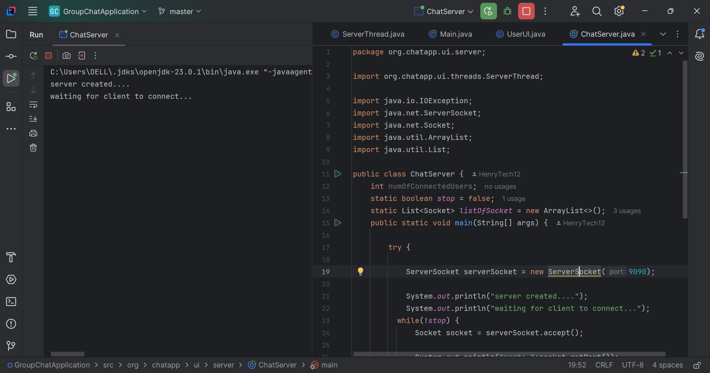
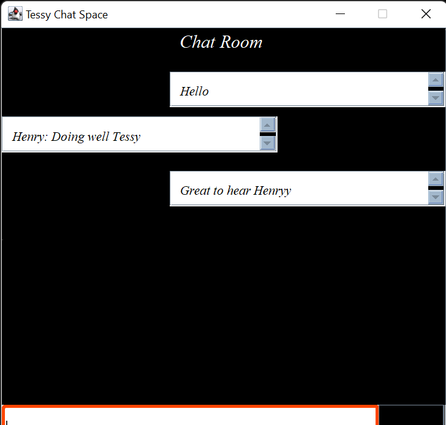
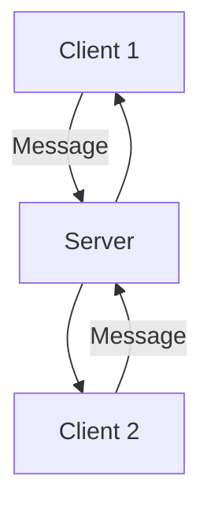

# 💬 Java Group Chat Application

  
A **Multi-client Group Chat Application** using **Java GUI**, **Sockets**, and **Threads**. This app allows real-time communication between users over a local network using a custom server and Swing-based client interface.

---

## 📸 Preview

> _(Add screenshots here — replace with your actual image paths)_

| Server Console | Client GUI |
|----------------|------------|
|  |  |

---

## 🛠️ Built With

| Technology | Description |
|------------|-------------|
| ☕ Java     | Core language used |
| 🖼️ Swing    | GUI framework |
| 🧵 Threads  | For handling multiple clients |
| 🌐 Sockets | For network communication |

---

## 🚀 Features

- ✅ Multi-user group messaging
- ✅ Real-time updates using sockets
- ✅ Multi-threaded server for simultaneous clients
- ✅ Simple and interactive GUI using Java Swing
- ✅ Graceful client disconnection handling

---

## 📁 Project Structure

```plaintext
/GroupChatApp
│
├── ChatServer.java         // The server that listens for client connections
├── ChatClient.java         // The GUI-based client application
├── ClientThread.java  // Thread handler for each client
├── screenshots/        // Screenshots for README
└── README.md           // Documentation
```

---

## 🖥️ How to Run

### 🧩 Requirements

- Java 8 or higher
- Terminal / Command Prompt OR IDE (e.g., IntelliJ, Eclipse)

### 🔌 Step 1: Start the Server

```bash
javac ChatServer.java
java ChatServer
```

You should see:  
`Server started. Waiting for clients...`

### 💬 Step 2: Launch Clients

Open multiple terminals or run in multiple windows:

```bash
javac ChatClient.java
java ChatClient
```

Each client will be prompted for a username and will launch the chat window.

---

## ⚙️ How It Works



1. Server listens on a port for client connections.
2. Each client runs on a new thread.
3. Messages are broadcast to all connected clients.

---

## 🚧 Known Limitations

- ❌ No encryption (plaintext messages)
- ❌ No private chat / direct messages
- ❌ Basic GUI design

---

## 💡 Future Improvements

- 🔒 Add SSL encryption
- 👥 User login/authentication
- 💌 Private messaging (1-on-1)
- 🎨 GUI redesign using JavaFX

---

## 🙋‍♂️ Author

HenryTech
[](https://github.com/yourusername)  
📧 fakorodehenry@gmail.com

---

⭐ *If you found this useful, give it a star on GitHub!*
